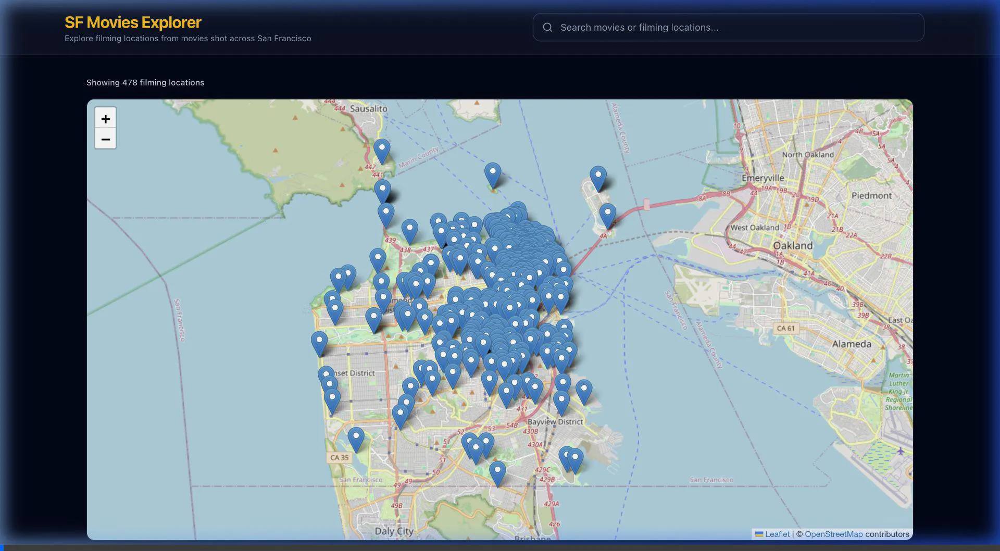

# SF Movies

An interactive full-stack web application for exploring movie filming locations across San Francisco using DataSF film-location data.

## Live Demo

- **Frontend**: [https://sf-movies-delta.vercel.app](https://sf-movies-delta.vercel.app)
- **Backend API**: [https://sf-movies-api.onrender.com](https://sf-movies-api.onrender.com)
- **API Documentation**: [https://sf-movies-api.onrender.com/docs](https://sf-movies-api.onrender.com/docs)

## Demo Video



---

## Overview

**SF Movies** allows users to discover where famous movies were filmed across San Francisco on an interactive map. 

Users can search by movie title or filming location using real-time autocomplete suggestions. Selecting a suggestion instantly filters the map markers and adjusts the viewport bounds to focus on matching filming locations.

The system is built as a decoupled full-stack application featuring a React + TypeScript frontend and a FastAPI (Python 3.14) backend. The backend acts as a domain service layer that ingests, cleans, normalizes, and filters public DataSF film locations data before exposing REST endpoints to the frontend.

---

## Features

- **Interactive San Francisco Map**: Map powered by Leaflet and OpenStreetMap centered on San Francisco.
- **Filming Location Markers**: Dynamic map markers placed at precise WGS84 geographic coordinates.
- **Detailed Marker Popups**: Custom styled popups displaying movie title, release year, location name, neighborhood, director, cast list, production studio, and fun facts.
- **Real-Time Autocomplete Search**: Debounced search bar returning instant recommendations categorized by movie title or filming location.
- **Server-Side Filtering**: Selecting an autocomplete suggestion queries the backend for matching records.
- **Automatic Map Bounds**: Dynamic viewport auto-fitting to encompass single or multiple location markers with padding.
- **Loading & Error Handling**: Graceful loading indicators, retry controls for network failures, and empty search state callouts.
- **Responsive Layout**: Designed for mobile and desktop screens.

---

## Architecture

```text
User Interface (Browser)
       │
       ▼
React + TypeScript Frontend (Vite)
       │
       ├── Autocomplete Search Component (300ms Debounce)
       ├── Interactive Map Component (Leaflet / OpenStreetMap)
       └── Server State Management (TanStack Query)
       │
       ▼  HTTP / REST (JSON)
       │
FastAPI Backend (Python 3.14)
       │
       ├── API Layer (`app/api/v1/` — Request validation & OpenAPI)
       ├── Service Layer (`app/services/` — Normalization, ranking, deduplication)
       └── Upstream Client (`app/clients/` — Async HTTPX DataSF integration)
       │
       ▼  SoQL REST Queries
       │
DataSF Film Locations API (`yitu-d5am.json`)
```

---

## Tech Stack

### Frontend
- **Framework**: React 19, TypeScript
- **Build Tool**: Vite
- **Server State & Caching**: TanStack Query (React Query)
- **Map Library**: Leaflet, React Leaflet
- **Styling**: Tailwind CSS v4, Lucide React Icons
- **HTTP Client**: Axios
- **Testing**: Vitest, React Testing Library

### Backend
- **Framework**: Python 3.14, FastAPI
- **Data Validation & Schemas**: Pydantic v2, Pydantic-Settings
- **Async HTTP Client**: HTTPX
- **Package & Environment Management**: `uv`
- **ASGI Server**: Uvicorn
- **Testing**: Pytest, Pytest-Asyncio, AnyIO

### Infrastructure & Deployment
- **Frontend Hosting**: Vercel
- **Backend Hosting**: Render
- **Tile Provider**: OpenStreetMap

---

## Data Source & Architecture Decisions

### DataSF Integration
Data is sourced from the official [DataSF Film Locations API](https://data.sfgov.org/resource/yitu-d5am.json). Raw records contain movie titles, release years, location descriptions, directors, actors, production companies, and geographic coordinates.

### Key Engineering Decision: No External Geocoding Required
The DataSF dataset already provides latitude and longitude fields (`latitude`, `longitude`). By parsing and validating these coordinates on the backend:
1. **Zero External Geocoding Overhead**: Eliminates third-party geocoding API keys, billing requirements, and rate limits (e.g. Google Maps Geocoding or Nominatim).
2. **Reduced Latency & Points of Failure**: DataSF records are rendered directly on the map without sequential HTTP calls per location.
3. **Data Quality Validation**: Backend filters out malformed or out-of-bounds geographic coordinates (`-90 to 90` lat, `-180 to 180` lng) during normalization.

---

## Project Structure

```text
sf-movies/
├── backend/
│   ├── app/
│   │   ├── api/
│   │   │   └── v1/             # API routes (health, movies, search)
│   │   ├── clients/            # DataSF HTTPX async API client
│   │   ├── core/               # App configuration, logging, exceptions
│   │   ├── middleware/         # Request logging middleware
│   │   ├── schemas/            # Pydantic request/response models
│   │   ├── services/           # MovieService business logic
│   │   └── main.py             # FastAPI app initialization
│   ├── tests/                  # Pytest test suite (62 tests)
│   ├── pyproject.toml          # Project dependencies & tool configs
│   ├── requirements.txt        # Exported dependencies
│   └── README.md
│
├── frontend/
│   ├── src/
│   │   ├── api/                # Axios API client modules
│   │   ├── components/         # Search, map, popup, and common components
│   │   ├── constants/          # Default map coordinates & config
│   │   ├── hooks/              # Custom hooks (debounce, query hooks)
│   │   ├── pages/              # Main view pages (HomePage)
│   │   ├── types/              # TypeScript interfaces
│   │   └── main.tsx            # React application entry point
│   ├── src/App.test.tsx        # Vitest integration tests (18 tests)
│   ├── package.json
│   ├── tsconfig.json
│   └── vite.config.ts
│
├── .gitignore
├── PROJECT_PROGRESS.md
└── README.md
```

---

## API Endpoints

| Method | Endpoint | Description | Query Parameters |
|---|---|---|---|
| `GET` | `/api/v1/health` | Service health check | None |
| `GET` | `/api/v1/movies` | Fetch normalized film locations | `title`, `location`, `search`, `year`, `limit`, `offset` |
| `GET` | `/api/v1/search/suggestions` | Autocomplete recommendations | `q` (min 2 chars), `limit` (default 10) |
| `GET` | `/docs` | Interactive Swagger API docs | None |
| `GET` | `/openapi.json` | OpenAPI schema JSON | None |

### Example Request

```bash
curl "https://sf-movies-api.onrender.com/api/v1/movies?title=Vertigo"
```

---

## Search & Map Flow

```text
User types in Search Bar
         │
         ▼
300ms Debounce Delay (prevents API spam)
         │
         ▼
GET /api/v1/search/suggestions?q={query}
         │
         ▼
User selects Suggestion (Movie or Location)
         │
         ▼
GET /api/v1/movies?title={value}  OR  ?location={value}
         │
         ▼
Map Markers update & Viewport auto-fits location bounds
```

---

## Getting Started

### Prerequisites
- **Node.js**: v20+
- **Python**: v3.14+
- **`uv`**: Fast Python package installer (`pip install uv` or `brew install uv`)

### 1. Clone Repository
```bash
git clone https://github.com/darshilshahai/sf-movies.git
cd sf-movies
```

### 2. Backend Setup
```bash
cd backend

# Install dependencies & create virtual environment
uv sync

# Run development server
uv run uvicorn app.main:app --reload --port 8000
```
- Backend API running at: `http://localhost:8000`
- Swagger Documentation: `http://localhost:8000/docs`

### 3. Frontend Setup
```bash
cd frontend

# Install dependencies
npm install

# Run development server
npm run dev
```
- Frontend application running at: `http://localhost:5173`

---

## Environment Variables

### Backend (`backend/.env.example`)
```env
APP_NAME="SF Movies API"
APP_ENV=development
API_PREFIX=/api/v1
LOG_LEVEL=INFO
FRONTEND_URL=http://localhost:5173
CORS_ORIGINS="*"
DATASF_BASE_URL=https://data.sfgov.org/resource/yitu-d5am.json
DATASF_APP_TOKEN=
DATASF_TIMEOUT_SECONDS=10.0
ENABLE_DOCS=True
```

### Frontend (`frontend/.env.example`)
```env
VITE_API_BASE_URL=http://localhost:8000
```

---

## Running Tests

### Backend Unit & Integration Tests (Pytest)
```bash
cd backend
uv run pytest
```
- **Coverage**: 62 tests across configuration, health endpoints, DataSF HTTP client, MovieService normalization, movies REST API, and autocomplete search API.
- **Result**: `62 passed`

### Frontend Unit & Component Tests (Vitest)
```bash
cd frontend
npm test
```
- **Coverage**: 18 tests across component rendering, keyboard navigation, debounced search, outside-click dismissal, map popup formatting, and error state recovery.
- **Result**: `18 passed`

---

## Production Build

### Build Frontend Bundle
```bash
cd frontend
npm run build
```
Executes TypeScript compilation (`tsc -b`) and Vite production bundle optimization into `frontend/dist/`.

---

## Deployment

- **Frontend**: Deployed on **Vercel** (`https://sf-movies-delta.vercel.app`). Automatically builds from the `production` branch.
- **Backend**: Deployed on **Render** (`https://sf-movies-api.onrender.com`). Runs Uvicorn ASGI server with automatic HTTPS.

*Note: The free tier of Render puts the backend to sleep after inactivity. Initial request cold-starts may take 15–30 seconds.*

---

## Engineering Decisions & Tradeoffs

1. **Decoupled Architecture**: Keeping frontend and backend separate allows independent scaling, isolated unit testing, and flexibility to swap UI frameworks or data providers.
2. **No Persistent Database**: Raw film data is served dynamically from DataSF. Since this project presents public government data without user accounts or custom state, adding a database (PostgreSQL/MongoDB) would introduce redundant sync logic.
3. **TanStack Query Caching**: Client-side state caching avoids duplicate network requests when switching between previously viewed search filters.
4. **CORS Security Configuration**: Configured FastAPI `CORSMiddleware` to support Vercel preview environments (`https://*.vercel.app`) and production domains safely.

---

## Error Handling & Resiliency

- **Upstream Failures**: If DataSF is unreachable or times out, the backend returns a structured `502 Bad Gateway` error envelope rather than crashing.
- **Data Normalization Defensiveness**: Missing actor lists, null locations, or non-numeric coordinate strings in DataSF records are safely handled without failing the request.
- **Search Error Localization**: Search autocomplete API failures stay isolated inside the search dropdown without breaking the active map view.

---

## Known Limitations

- **Marker Overlap**: Locations with identical coordinate values (e.g. multiple scenes filmed at the exact same building) overlap on the map.
- **Upstream Dependency**: Application availability depends on DataSF API uptime and OpenStreetMap tile server responsiveness.
- **Free Tier Cold Starts**: Render free-tier web services experience cold-start delays on initial requests after periods of inactivity.

---

## Developer

**Darshil Shah**  
Full-Stack Engineer & AI Engineer  
- **GitHub**: [https://github.com/darshilshahai](https://github.com/darshilshahai)  
- **LinkedIn**: [https://www.linkedin.com/in/darshilshah-ai/](https://www.linkedin.com/in/darshilshah-ai/)  
- **Email**: `darshilshah.ai@gmail.com`